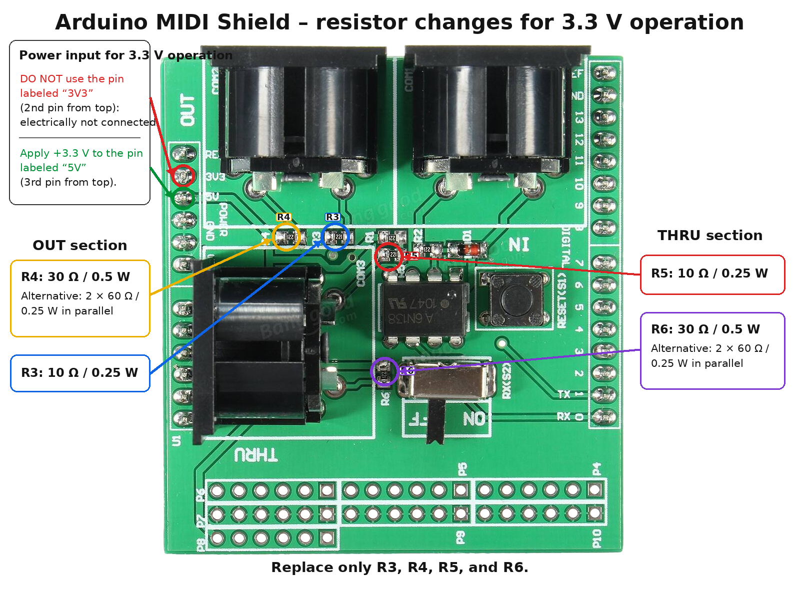

# Using the Arduino MIDI Shield at 3.3 V

## Purpose of this modification

The low-cost Arduino MIDI Shield shown in this guide was originally designed for use with 5 V Arduino-compatible systems.

MiniJV880 is based on a Raspberry Pi and uses 3.3 V GPIO logic. Applying 5 V directly to a Raspberry Pi GPIO may permanently damage the Raspberry Pi. For this reason, the shield used in MiniJV880 is powered entirely from 3.3 V instead of its original 5 V supply.

This places the shield outside its original intended operating conditions. The modification described here adapts the MIDI OUT and MIDI THRU transmitter circuits for operation from a 3.3 V supply.

It does not guarantee that every shield, optoisolator, board revision or connected MIDI device will work correctly at 3.3 V.



---

## Important power connection

For the specific shield revision shown in the annotated image, the external 3.3 V supply must be connected to the header pin marked:

```text
5V
```

This is the third pad from the top on the upper-left vertical header.

Despite the printed `5V` label, this pin is used as the shield’s main power input. In the MiniJV880 configuration it must receive **3.3 V only**.

Do not use the adjacent pad marked:

```text
3V3
```

This is the second pad from the top. On the shield examined and tested for this project, that pad is not electrically connected to the shield’s power rail.

Do not rely only on the PCB labels. Before applying power, confirm the connections with a multimeter, especially if the shield layout or revision differs from the one shown here.

---

## Why the resistor values must be changed

MIDI OUT and MIDI THRU are current-loop interfaces. Correct operation depends on supplying sufficient current to the optoisolator inside the receiving MIDI device.

In the original 5 V circuit, this shield uses two 220 Ω resistors for MIDI OUT and another two 220 Ω resistors for MIDI THRU.

If the shield is powered at only 3.3 V while retaining those original resistor values, the available loop current may be too low.

Possible symptoms include:

- no MIDI data received;
- no MIDI IN activity on the receiving interface;
- intermittent or receiver-dependent operation;
- failure during long MIDI or System Exclusive transfers;
- an electrical signal being present at the DIN connector but not being recognised as valid MIDI data.

This behaviour was observed during the MiniJV880 tests.

The MIDI THRU signal was present, the 6N138 output switched correctly, and continuity to the DIN connector was confirmed. However, with R5 and R6 still at 220 Ω, the loop current was insufficient for the Roland UM-ONE mk2 to recognise the signal.

The MIDI OUT circuit began working reliably after its transmitter resistor values were adapted for 3.3 V operation.

---

## Resistors to replace

Replace only the following four resistors:

| Circuit | Reference | Replacement |
|---|---:|---:|
| MIDI OUT, signal side | R3 | 10 Ω / 0.25 W |
| MIDI OUT, supply side | R4 | 33–34 Ω / 0.5 W |
| MIDI THRU, signal side | R5 | 10 Ω / 0.25 W |
| MIDI THRU, supply side | R6 | 33–34 Ω / 0.5 W |

For R4 and R6, a practical solution is to connect two commonly available 68 Ω / 0.25 W resistors in parallel:

```text
68 Ω || 68 Ω = 34 Ω
```

This produces approximately:

```text
Equivalent resistance: 34 Ω
Combined power rating: 0.5 W
```

The resulting value is very close to the 33 Ω value normally used for the supply-side resistor of a 3.3 V MIDI transmitter.

The following configuration was successfully tested on MiniJV880:

```text
R3 = 10 Ω / 0.25 W

R4 = 2 × 68 Ω / 0.25 W in parallel
     approximately 34 Ω / 0.5 W

R5 = 10 Ω / 0.25 W

R6 = 2 × 68 Ω / 0.25 W in parallel
     approximately 34 Ω / 0.5 W
```

A single 33 Ω or 34 Ω resistor with a suitable power rating may also be used.

Do not replace nearby resistors merely because they look similar. Confirm the exact positions of R3, R4, R5 and R6 against the annotated image before desoldering anything.

---

## MIDI OUT and MIDI THRU resistor correspondence

On this shield, the modified resistor pairs are:

```text
MIDI OUT:
R4 = supply side
R3 = signal side

MIDI THRU:
R6 = supply side
R5 = signal side
```

The functional correspondence is therefore:

```text
R4 corresponds to R6
R3 corresponds to R5
```

For 3.3 V operation:

```text
R3 and R5 → 10 Ω

R4 and R6 → approximately 33–34 Ω
```

---

## MIDI THRU circuit considerations

On this shield, MIDI THRU is driven directly from the RX output of the MIDI IN optoisolator circuit.

There is no separate transistor, logic gate or output buffer between the 6N138 output and the THRU transmitter resistor network.

The relevant path is:

```text
3.3 V
  |
 R6
  |
DIN pin 4
  |
receiving MIDI input
  |
DIN pin 5
  |
 R5
  |
RX output of the 6N138
```

When the whole shield is powered from 3.3 V, MIDI THRU must therefore be treated as a 3.3 V MIDI transmitter.

Leaving R5 and R6 at their original 220 Ω values may result in a signal that is electrically present but unable to provide sufficient current to the receiving device.

---

## Verify the optoisolator before modifying the board

This shield uses a 6N138-family optoisolator in its MIDI IN circuit.

The original shield was designed for a 5 V supply. Operation of the 6N138 at 3.3 V must not be assumed to work reliably on every board or with every device.

Differences may exist between:

- optoisolator manufacturers;
- production batches;
- genuine and clone components;
- shield revisions;
- pull-up resistor values;
- connected controllers or MIDI interfaces;
- temperature and supply tolerance.

Before modifying R3, R4, R5 and R6, first verify that the MIDI IN section works at least partially when the shield is powered from 3.3 V.

At minimum, confirm that:

- the shield power rail is approximately 3.3 V;
- the RX output rests near 3.3 V when no MIDI data is being received;
- the RX output changes state when data is sent to MIDI IN;
- no point connected to a Raspberry Pi GPIO exceeds the safe GPIO voltage;
- the optoisolator does not become hot;
- the optoisolator does not remain permanently high or low;
- the circuit does not draw abnormal current.

A multimeter may confirm that RX changes between idle and active states, but it cannot accurately verify pulse shape, rise time, fall time or timing margins.

An oscilloscope or logic analyser is preferable where available.

If the 6N138 does not work reliably from 3.3 V, changing the MIDI OUT and MIDI THRU resistor values will not solve the MIDI IN problem.

In that case, safer alternatives include:

- using an optoisolator and receiver circuit designed for 3.3 V operation;
- powering the receiver section from 5 V and adding proper 3.3 V level conversion;
- using a dedicated 3.3 V MIDI interface;
- redesigning the input and THRU circuits with a suitable buffer.

---

## Operational limits

This modification has been tested only on the shield revision shown in the annotated image and in the MiniJV880 hardware configuration.

It must not be assumed to apply unchanged to:

- another Arduino MIDI Shield layout;
- a shield with different reference designators;
- a board using a different optoisolator;
- a shield with a buffered MIDI THRU circuit;
- a shield on which the `3V3` pad is electrically connected;
- a system using 5 V GPIO logic;
- another Raspberry Pi or microcontroller wiring arrangement;
- a board with different DIN connector routing.

Operation with one MIDI interface does not guarantee compatibility with every MIDI device.

Some receiving devices may use non-standard input circuits, incorrect resistor values or circuits that do not follow the expected optoisolated MIDI current-loop design.

A successful short-note test also does not guarantee reliable operation during:

- long System Exclusive transfers;
- bulk dumps;
- dense MIDI controller traffic;
- long cables;
- long MIDI THRU chains;
- low or unstable supply voltage;
- high-temperature operation.

Each MIDI OUT or MIDI THRU connector should drive only one MIDI input.

Do not use passive splitter cables to connect multiple MIDI inputs to a single MIDI output.

Long MIDI THRU chains should be avoided because each optoisolator stage can add delay and waveform distortion.

---

## Safety precautions

Perform this modification only if you can identify SMD components, use a multimeter correctly and make reliable solder joints.

Before beginning:

1. Disconnect the shield from the Raspberry Pi.
2. Disconnect all MIDI cables.
3. Disconnect all power sources.
4. Confirm the exact shield revision.
5. Verify the locations of R3, R4, R5 and R6.
6. Verify which header pad actually powers the shield.
7. Confirm that the pad marked `3V3` is not connected on this specific board.
8. Record or photograph the original resistor values and positions.
9. Check that the replacement resistors have the intended resistance and power rating.

After soldering:

1. Inspect the board for solder bridges.
2. Check for lifted pads or damaged traces.
3. Check that no resistor lead touches an adjacent pad.
4. Measure the resistance between the supply rail and ground.
5. Verify that no short circuit is present.
6. Check continuity from each replacement resistor to the intended DIN connector pin.
7. Confirm that R3 and R5 are not accidentally exchanged with nearby components.
8. Confirm that R4 and R6 are connected to the supply side of their respective output circuits.

Do not perform continuity or resistance measurements while the board is powered.

For the first powered test:

- use a current-limited 3.3 V supply where possible;
- power the shield without connecting it to the Raspberry Pi;
- verify the supply voltage;
- verify the RX voltage;
- confirm that no GPIO-related node rises above 3.3 V;
- monitor for excessive current, heat or smell;
- disconnect power immediately if anything appears abnormal.

Only connect the Raspberry Pi after the shield voltages have been verified.

Do not apply 5 V to the modified shield while it is connected to Raspberry Pi GPIO pins.

---

## Recommended validation after modification

Test MIDI IN, MIDI OUT and MIDI THRU separately.

### MIDI IN

Connect:

```text
Computer or MIDI controller
→ MIDI interface OUT
→ shield MIDI IN
→ MiniJV880
```

Confirm that the MiniJV880 receives known MIDI messages correctly.

Test more than one message type where possible, for example:

- Note On and Note Off;
- Control Change;
- Program Change;
- System Exclusive commands used by MiniJV880.

### MIDI OUT

Connect:

```text
MiniJV880
→ shield MIDI OUT
→ MIDI interface IN
→ computer
```

Test a substantial transfer rather than only isolated notes.

A complete System Exclusive dump is recommended.

Confirm:

- receiving-interface MIDI IN activity;
- a non-zero captured file;
- complete MIDI messages;
- no communication error;
- no stalled transmission;
- valid Roland checksums where applicable.

The MiniJV880 MIDI OUT modification was validated using complete JV-880 dumps, including Temporary Dump All and Bulk Dump INT.

### MIDI THRU

Connect:

```text
Computer
→ MIDI interface OUT
→ shield MIDI IN
→ shield MIDI THRU
→ MIDI interface IN
→ computer
```

Confirm:

- MIDI OUT activity from the transmitting interface;
- MIDI IN activity on the receiving interface;
- a non-zero captured file;
- correct byte count;
- data matching the transmitted stream;
- reliable operation during sustained traffic.

Do not connect the two MIDI interface cables directly together for this test. The signal must pass through the shield’s MIDI IN and MIDI THRU circuits.

---

## Reversibility and documentation

Before modifying the board, keep a record of:

- the shield model and revision;
- the original resistor values;
- the replacement resistor values;
- the optoisolator marking;
- photographs before and after modification;
- supply-voltage measurements;
- RX idle and active measurements;
- the MIDI interfaces and devices used during testing.

If the original components are removed intact, label and store them so the shield can be restored to its original 5 V configuration.

A restored 5 V shield must not be connected directly to Raspberry Pi GPIO pins without appropriate voltage protection or level conversion.

---

## Disclaimer

This is an experimental, user-performed hardware modification that operates the MIDI Shield outside its original intended configuration.

The information is provided for technical documentation and educational purposes only.

No warranty is provided, either express or implied, regarding:

- electrical safety;
- MIDI standards compliance;
- reliability;
- compatibility;
- component lifetime;
- suitability for a particular purpose;
- protection of connected equipment;
- correct operation on another board revision.

The modification has been tested only on the specific shield and MiniJV880 configuration described in this project.

Board revisions, component tolerances, counterfeit or substitute components, soldering quality, wiring mistakes, connected equipment and power-supply differences may produce different results.

Anyone performing this modification does so entirely at their own risk and accepts full responsibility for any consequence, including but not limited to:

- damage to the MIDI Shield;
- damage to a Raspberry Pi;
- damage to a computer or USB MIDI interface;
- damage to a synthesizer or other MIDI equipment;
- damaged GPIO pins;
- short circuits;
- overheating;
- loss of electrical isolation;
- unreliable MIDI operation;
- corrupted data;
- personal injury;
- property damage;
- any direct or indirect loss.

The project authors, repository maintainers and contributors shall not be held responsible for damage, malfunction, incompatibility, injury or loss resulting from following, misunderstanding or adapting these instructions.

If there is any uncertainty about the board layout, power pins, component identity, soldering procedure or measured voltages, do not perform the modification.

Use a commercially available MIDI interface explicitly designed for 3.3 V systems instead.
